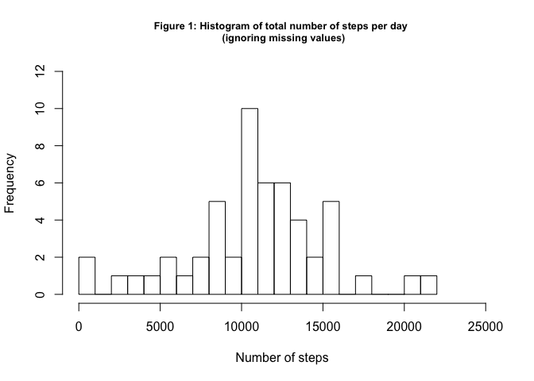
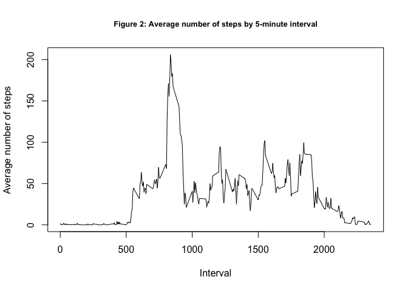
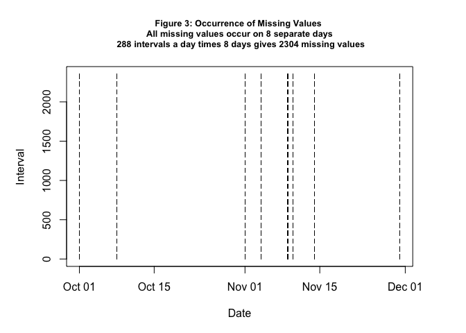
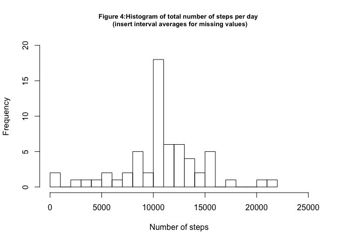
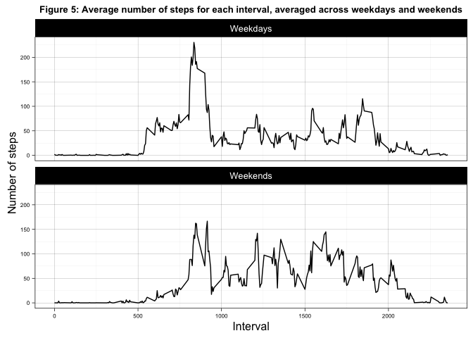

# Reproducible Research - Assignment 1


#### Loading and processing the data

Download data and assign to data frame named "ad"


```r
temp <- tempfile()
download.file("https://d396qusza40orc.cloudfront.net/repdata%2Fdata%2Factivity.zip",temp)
unzip(temp)
unlink(temp)

ad<-read.csv("activity.csv")
```

#### What is the mean total number of steps taken per day?

*Note: Ignoring missing values in dataset for this part of the assignment, as instructed*

1.  Calculate the total number of steps taken per day


```r
adly<-aggregate(steps~date,ad,sum)
```

2. Histogram of total number of steps taken per day


```r
hist(adly$steps,breaks=22,main="Figure 1: Histogram of total number of steps per day \n (ignoring missing values)",xlab="Number of steps",ylim=c(0,12),xlim=c(0,25000),cex.main=0.8)
```



3. Mean and Median of total number of steps per day


```r
print (paste("Mean of Total Steps/Day:  ",round(mean(adly$steps),0)))
```

```
## [1] "Mean of Total Steps/Day:   10766"
```

```r
print (paste("Median of Total Steps/Day:  ",round(median(adly$steps),0)))
```

```
## [1] "Median of Total Steps/Day:   10765"
```


#### What is the average daily activity pattern?

1.  Time series plot (i.e. 𝚝𝚢𝚙𝚎 = "𝚕") of the 5-minute interval (x-axis) and the average number of steps taken, averaged across all days (y-axis).

Examine structure of 5 minute interval codes


```r
head(ad[ad[,2]=="2012-10-01",3],20)
```

```
##  [1]   0   5  10  15  20  25  30  35  40  45  50  55 100 105 110 115 120
## [18] 125 130 135
```

```r
tail(ad[ad[,2]=="2012-10-01",3])
```

```
## [1] 2330 2335 2340 2345 2350 2355
```
Notice that "0" represents 12:00-12:05 am and so on up to 12:55-1:00 am.  "23:00" represents 23:00-23:05 pm etc.  Ths will be useful in understanding the form of the plot for this question, and in answering question 2 in this section.

Calculate average number of steps for each 5 minute interval of the day, averaged across all days.


```r
aint<-aggregate(steps~interval,ad,mean)
```

Create a time series plot of average number of steps per 5 minute interval of the day.


```r
with(aint,plot(interval,steps,type="l",main="Figure 2: Average number of steps by 5-minute interval",xlab="Interval",ylab="Average number of steps",cex.main=0.8))
```



2.  Which 5-minute interval, on average across all the days in the dataset, contains the maximum number of steps?


```r
print(paste("Interval with maximum steps on average:  ",aint[which(aint[,2]==max(aint[,2])),1]))
```

```
## [1] "Interval with maximum steps on average:   835"
```
Interval 835 has, on average, maximum number of steps.  Interval 835 represents **8:30 am - 8:35 am**.


#### Impute missing values

1.Calculate and report the total number of missing values in the dataset


```r
print (paste("Number of missing values: ", sum(is.na(ad))))
```

```
## [1] "Number of missing values:  2304"
```
Let's investigate which days and intervals have missing date.  First, take a subset of missing values:


```r
isna<-subset(ad,is.na(ad[,1]))
```

Then, plot dates and intervals:


```r
par(mar=c(5,5,5,4))
with(isna,plot(as.Date(date),interval,pch=".",xlab="Date",ylab="Interval",main="Figure 3: Occurrence of Missing Values \n All missing values occur on 8 separate days \n 288 intervals a day times 8 days gives 2304 missing values",cex.main=0.8))
```




2. Strategy for filling in missing values.

Use average of 5-minute intervals across all days as proxy for missing interval value.

3.  Create new dataset with missing values filled in

Copy data frame "ad" into new data frame "nad".


```r
nad<-ad
```

Insert missing values - Use average of 5-minute intervals across all days (from data frame "aint") as proxy for missing interval values.


```r
for(id in 1:nrow(aint)){
  nad[is.na(nad$steps),1][nad[is.na(nad$steps),3] %in% aint$interval[id]] <- aint$steps[id]
}
```

4. Histogram, Mean, Median with missing values filled in.


```r
nadly<-aggregate(steps~date,nad,sum)
hist(nadly$steps,breaks=22,main="Figure 4:Histogram of total number of steps per day \n (insert interval averages for missing values)",xlab="Number of steps",ylim=c(0,20),xlim=c(0,25000),cex.main=0.8)
```




```r
print (paste("Mean of Total Steps/Day:  ",round(mean(nadly$steps),0)))
```

```
## [1] "Mean of Total Steps/Day:   10766"
```

```r
print (paste("Median of Total Steps/Day:  ",round(median(nadly$steps),0)))
```

```
## [1] "Median of Total Steps/Day:   10766"
```

Table 1 compares mean and median of total daily steps.


```r
library (xtable)
tab<-data.frame("Mean" = c(round(mean(adly$steps),0),round(mean(nadly$steps),0)),"Median"=c(round(median(adly$steps),0),round(median(nadly$steps),0)),row.names=c("With Missing Values ","With Imputed Values "))
xt<-xtable(tab,caption="Table 1: Mean and Median Values of Total Daily Steps",auto=TRUE)
print(xt,type="html")
```

<!-- html table generated in R 3.2.3 by xtable 1.8-2 package -->
<!-- Sun Apr 10 00:21:16 2016 -->
<table border=1>
<caption align="bottom"> Table 1: Mean and Median Values of Total Daily Steps </caption>
<tr> <th>  </th> <th> Mean </th> <th> Median </th>  </tr>
  <tr> <td> With Missing Values  </td> <td align="right"> 10766 </td> <td align="right"> 10765 </td> </tr>
  <tr> <td> With Imputed Values  </td> <td align="right"> 10766 </td> <td align="right"> 10766 </td> </tr>
   </table>
As Table 1 shows, there is no significant difference in Mean and Median values with and without missing values.  This is because the strategy to fill in the missing values was to fill in the blanks with interval averages.  In addition, given that the missing values are eight full days, the strategy for imputing the missing values results in adding 8 "average" days in place of the missing 8 days.  Therefore, the mean will remain unchanged.  In addition the difference between Figures 1 and 4 is essentialy that addition of eight avergae days - Figure 4 has 8 more days in the center bar than Figure 1.

#### Are there differences in activity patterns between weekdays and weekends?

1. Create a new factor variable in the dataset with two levels -- "weekday" and "weekend".


```r
wkdys<-c("Monday","Tuesday","Wednesday","Thursday", "Friday")
nad$wd <- factor((weekdays(as.Date(nad$date)) %in% wkdys), 
        levels=c(TRUE, FALSE), labels=c('Weekdays', 'Weekends') )
```
2. Make a plot of interval averages across weekdays and weeknds

Calculate interval averages for weekdys and weekends


```r
nadintw<-aggregate(nad[,1],nad[,c(3,4)],FUN=mean)
```

Use ggplot to create a panel plot.


```r
library(ggplot2)

g<-ggplot(nadintw,aes(interval,x))
g<-g+geom_line()
g<-g+facet_wrap(~wd,ncol=1)
g<-g+theme_linedraw()
g<-g+labs(title="Figure 5: Average number of steps for each interval, averaged across weekdays and weekends")
g<-g+labs(x="Interval",y="Number of steps")
g<-g+theme(plot.title = element_text(size=10,face="bold"),axis.text.x=element_text(size=6),axis.text.y=element_text(size=6))
print(g)
```


